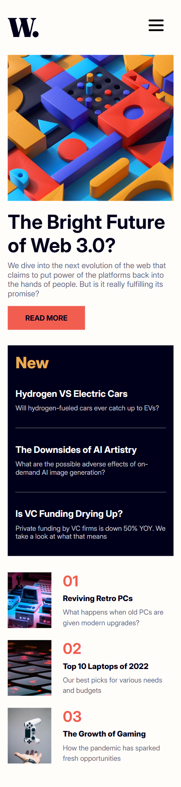
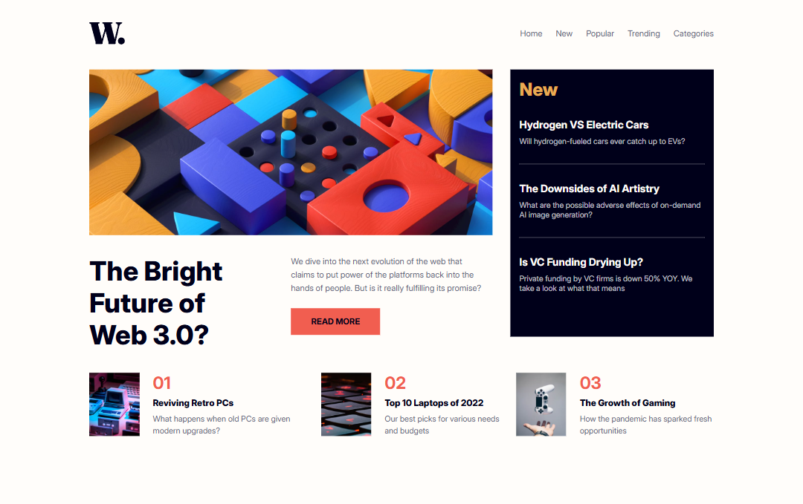

# 📰 News Homepage

<div>
  
  
  
</div>

Uma página **mobile/desktop** web que simula notícias de tecnologia. Desenvolvido com o design disponibilizado pelo site **Frontend Mentor**.

| Mobile | Desktop |
|--------|---------|
|  |  |

*Imagem meramente ilustrativa, pois ela muda dependendo do tamanho da tela do seu celular/computador!

- Mobile: 375px
- Desktop: 1440px

## 📌 Desafios enfrentados 

Durante a execução do projeto, optei por utilizar a versão gratuita do Frontend Mentor, a qual não disponibiliza os arquivos de design (Figma) ou especificações detalhadas de medidas. Diante dessa limitação, as decisões de layout e proporções foram baseadas em **avaliação visual ("a olho")**, exigindo atenção redobrada para garantir a fidelidade ao design proposto. 

Implementei um **menu hamburguer** totalmente personalizado, desde a estrutura até a interação. Apesar de ser um componente aparentemente simples, esta foi a primeira oportunidade em que o construí integralmente do zero. 

Adotei a abordagem **mobile-first** utilizando React, priorizando a otimização da experiência em dispositivos menores antes de escalar para telas maiores. Essa estratégia assegurou um desempenho consistente e uma base sólida para a responsividade.
Em resumo, durante esse projeto, reforcei fundamentos essenciais e adquiri maior domínio na criação de interfaces responsivas e interativas.


## 🌐 Deploy no GitHub Pages

O projeto está disponível online via GitHub Pages. Acesse <a href="https://helzaaragao.github.io/NewsHomepage/">aqui</a> para visualizar.

### 🛠️ Dependências e Versões Utilizadas

React: 19.0.0 | Typescript: 5.7.2 | Vite: 6.2.0 | Styled-components: 6.1.16 

### 📂 Como rodar o projeto na sua máquina local

OBS: é preciso já ter instalado o node.js, vscode ou um terminal da sua preferência para executar os comandos!

Clone esse repositório para os seus arquivos:
```
git clone https://github.com/helzaaragao/NewsHomepage.git
```

Depois, vá até a pasta que você acabou de criar com o comando anterior:

```
cd "CoffeeDelivery"
```
E instale todas as depedências e versões utilizadas por esse projeto:

```
npm install
```
Finalmente, rode no seu localhost:
```
npm run dev
```
